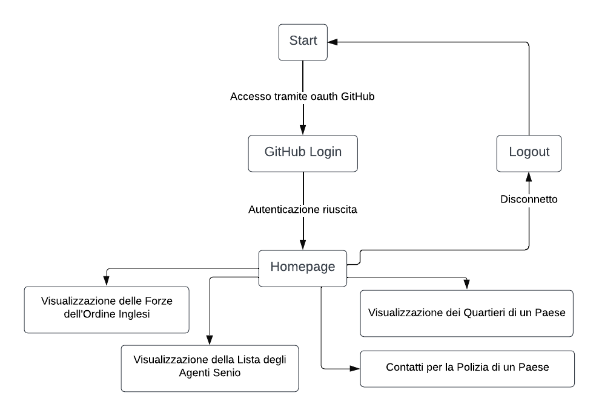

  # Applicazione di Gestione delle Informazioni di Polizia Inglese
  ## Ludovico Nigro
Questo progetto contiene un'applicazione web che utilizza il framework Flask che consente agli utenti di accedere a varie informazioni relative alla polizia di diversi paesi. Gli utenti possono autenticarsi utilizzando il loro account GitHub e accedere a diverse funzionalità dell'applicazione.

# Funzionalità Principali
* **Accesso tramite GitHub**: L'applicazione consente agli utenti di accedere utilizzando le loro credenziali GitHub.
* **Visualizzazione delle Forze dell'Ordine Inglesi**: Gli utenti possono visualizzare le informazioni sulle forze dell'ordine inglesi.
* **Visualizzazione della Lista degli Agenti Senior**: Gli utenti possono ottenere la lista degli agenti senior in un determinato paese.
* **Contatti per la Polizia di un Paese**: L'applicazione fornisce i contatti per la polizia di un paese specifico.
* **Visualizzazione dei Quartieri di un Paese**: Gli utenti possono visualizzare i quartieri di un paese specifico.

# Composizione del progetto
I progetto è composto da tre file **app.py**, **libb.py** e **file_html.py** divisi per una visione più essenziale del codice. di seguito spiegati:
* **app.py** : è il cuore del progetto, al suo interno sono presenti tutte le rotte dell'applicazione
* **libb.py** : al suo interno sono presenti le librerie utilizzate per le funzionalità del programma
* **file_html.py** : sono presenti i file html che vengono richiamate nel file app.py

# Diagramma di Flusso


# Rotte dell'Applicazione
* **/logout**: Rotta per il logout dell'utente.
* **/**: Rotta per la pagina iniziale dell'applicazione.
* **/Homepage**: Rotta per la homepage dell'applicazione.
* **/List_of_forces**: Rotta per visualizzare la lista delle forze di polizia.
* **/Senior_officers**: Rotta per visualizzare la lista degli ufficiali superiori.
* **/people_data/<city>**: Rotta per visualizzare i dati delle persone per una determinata città.
* **/force_data**: Rotta per visualizzare i dati relativi alle forze di polizia per una città specifica.
* **/quartiere_forze**: Rotta per visualizzare i quartieri di competenza di una forza di polizia.
* **/quartiere_forze_LISTA/<city>**: Rotta per visualizzare la lista dei quartieri di competenza di una forza di polizia per una città specifica.

# Avvio dell'Applicazione
Prima di avviare l'applicazione, assicurati di avere Flask installato nel tuo ambiente virtuale Python. Se non hai ancora installato Flask, puoi farlo eseguendo il seguente comando nel terminale:
```
pip install Flask
```
Una volta che Flask è stato installato con successo, puoi avviare l'applicazione seguendo i passaggi seguenti:
1. Assicurati di trovarti nella directory del progetto nel terminale.
2. Attiva l'ambiente virtuale eseguendo il seguente comando:
```
. venv/bin/activate
```
3. Imposta la variabile d'ambiente OAUTHLIB_INSECURE_TRANSPORT a 1 per consentire il trasporto non sicuro per OAuth.
   OAuth è un protocollo di autorizzazione standard che consente alle applicazioni di ottenere l'accesso limitato a un servizio su behalf di un utente, senza richiedere le credenziali di accesso direttamente. Di solito, il trasporto dei dati OAuth dovrebbe avvenire su un canale sicuro, come HTTPS, per proteggere i dati sensibili degli utenti durante la comunicazione.
Impostare OAUTHLIB_INSECURE_TRANSPORT su 1 indica che si desidera bypassare il controllo di sicurezza del trasporto per OAuth. 
Questo può essere utile in situazioni di sviluppo o test in cui non è necessario o praticabile utilizzare HTTPS, ma non è affatto raccomandato in ambienti di produzione o quando sono coinvolti dati sensibili degli utenti.
La variabile d'ambiente si può modificare con il comando:
```
export OAUTHLIB_INSECURE_TRANSPORT=1
```
  3.1. Flask supporta l'uso di certificati generati al volo, che sono utili per servire rapidamente un'applicazione tramite HTTPS senza dover gestire i               certificati manualmente. 
```
flask run --cert=adhoc
```
3.2. Attraverso strumenti quale OpenSSL si può generare un certificato SSL autofirmato. 
      Eseguendo il seguente comando nel terminale:
```
openssl req -x509 -newkey rsa:4096 -nodes -out cert.pem -keyout key.pem -days 365
```
Questo comando genera una nuova chiave privata RSA (key.pem) e un certificato autofirmato (cert.pem) valido per 365 giorni. 
Per avviare l'app bisogna sempre da terminale:

```
$ flask run --cert=cert.pem --key=key.pem
```
4. Avvia l'applicazione eseguendo il comando:
```
python app.py
```
5. Una volta avviato con successo, l'applicazione sarà accessibile tramite il browser web all'indirizzo locale http://localhost:5000/.

# Implementazioni future
Il progetto è in continua evoluzione e potrebbe includere le seguenti funzionalità in futuro:

* Implementazione di tutte le altre funzionalità offerte dall'API.
* Aggiunta della possibilità di autenticazione tramite servizi OAuth come Google, Apple o SPID.
* Espansione del servizio per includere l'integrazione con eventuali API fornite dalle forze dell'ordine italiane.
